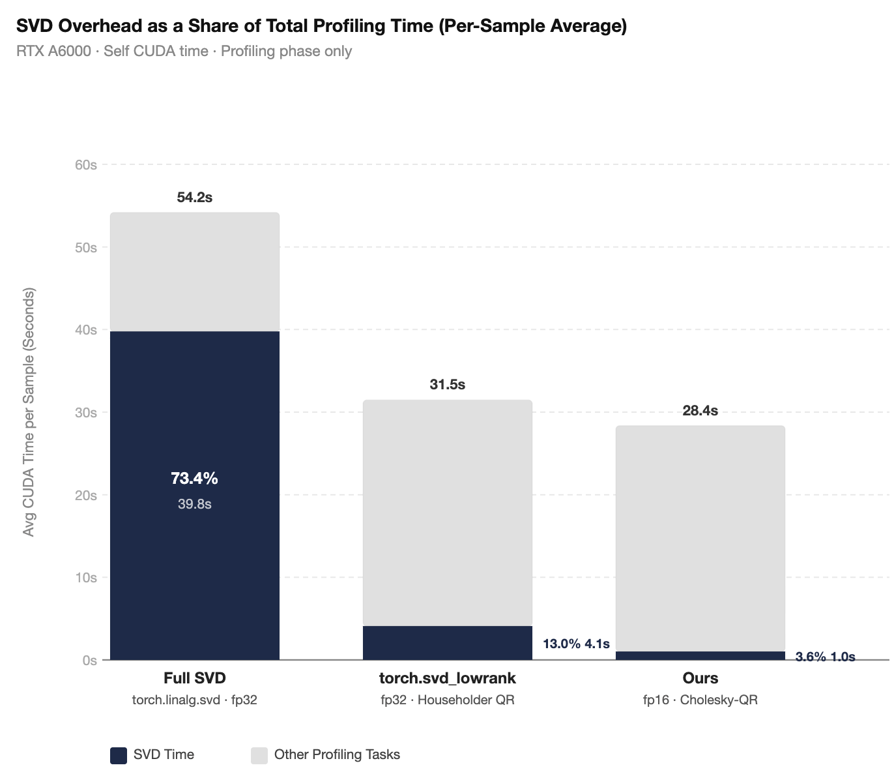
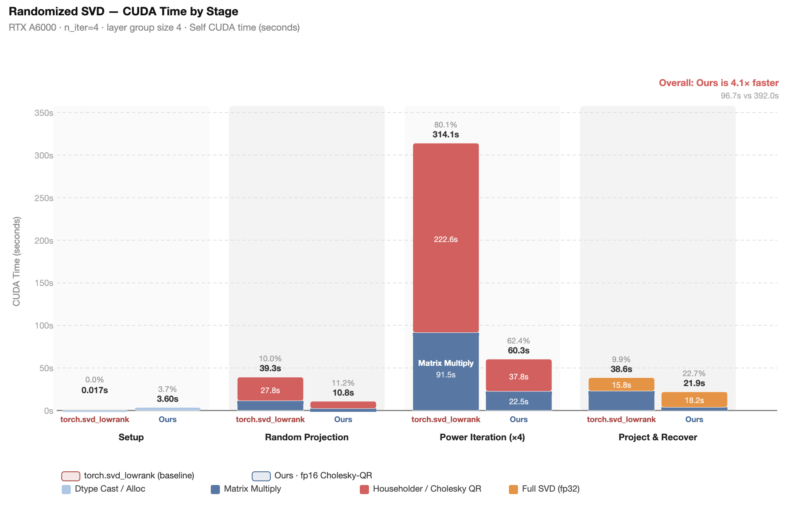
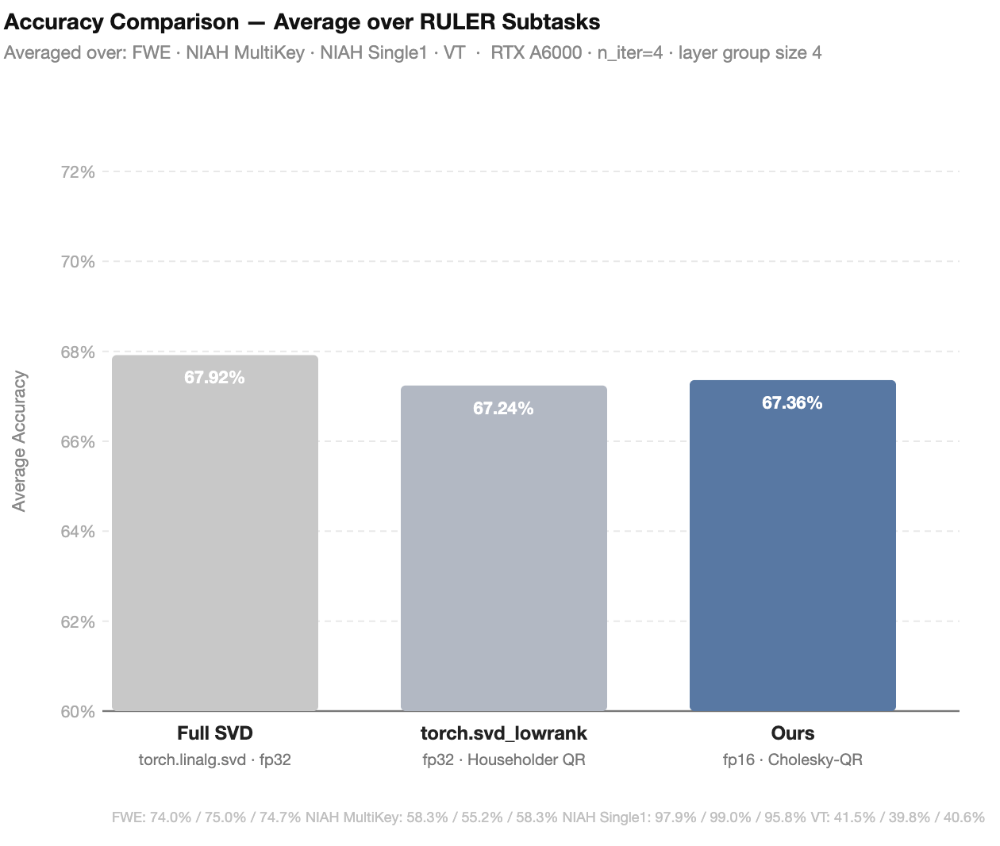

# Faster Online Randomized SVD for LLM KV-Cache Compression

Code: [github.com/bairixie/kv-svd](https://github.com/bairixie/kv-svd) · Evaluated within [xKV](https://github.com/abdelfattah-lab/xKV) · RTX A6000 · Meta-Llama-3.1-8B-Instruct

---

## Table of Contents

1. [Introduction](#1-introduction)
2. [Background: Singular Value Decomposition](#2-background-singular-value-decomposition)
3. [SVD for KV-Cache Compression](#3-svd-for-kv-cache-compression)
4. [Randomized SVD and Its Limitations](#4-randomized-svd-and-its-limitations)
5. [Our Method](#5-our-method)
6. [Experiments](#6-experiments)
7. [Limitations and Future Work](#7-limitations-and-future-work)
8. [References](#8-references)

---

## 1. Introduction

### 1.1 Memory Bottleneck in Long-Context LLM Inference

Large Language Models (LLMs) have rapidly extended their effective context windows, with open-source models now routinely supporting hundreds of thousands of tokens [Chang et al., 2025]. During autoregressive generation, the attention mechanism caches every previously computed Key and Value (KV) state — the **KV-Cache** — whose memory grows as $\mathcal{O}(L \cdot d \cdot N_\text{layers})$, where $L$ is the sequence length and $d$ the per-head hidden dimension. For a 32-layer model with $d = 512$ at 128k-token context in 16-bit precision, the KV-Cache alone requires tens of gigabytes, often rivaling the model weights and severely constraining inference throughput.

### 1.2 KV-Cache Compression via SVD

Among approaches to reduce KV-Cache memory — quantization, token eviction, and low-rank decomposition — **SVD-based compression** stands out for its theoretical grounding. KV-Cache matrices empirically exhibit rapid singular value decay, concentrating most information in a small number of dominant directions. Truncating to the top-$k$ singular components yields the *best possible* rank-$k$ approximation by the Eckart-Young theorem.

**xKV** [Chang et al., 2025] takes this further by observing that dominant singular vectors are well-aligned *across* adjacent layers. Concatenating the KV-Caches of $G$ adjacent layers and applying a single shared SVD extracts a common low-rank subspace for all layers jointly, achieving up to <span style="color:#1a6a5a">**6.8× higher compression**</span> than prior inter-layer methods at improved accuracy.

### 1.3 The Online SVD Latency Problem

Unlike weight-compression methods that amortize a one-time offline SVD, xKV must compute SVD **online** during the prefill phase of every request — the KV-Cache is input-dependent and changes with every sequence. As shown in [Section 6.2](#62-end-to-end-svd-latency), this online SVD step constitutes a significant and growing fraction of total prefill latency. Even the approximate `torch.svd_lowrank` — the standard PyTorch implementation of the Halko et al. [2011] randomized algorithm — remains a measurable bottleneck, while full SVD is not viable at scale. Two inefficiencies in `torch.svd_lowrank` leave significant hardware performance on the table, motivating the optimizations in this work.

### 1.4 Contributions

We present a faster, numerically robust randomized SVD for online KV-Cache compression, available at [github.com/bairixie/kv-svd](https://github.com/bairixie/kv-svd). Our method follows the same four-stage structure as `torch.svd_lowrank` with two targeted changes:

- <span style="color:#4e79a7">**16-bit power iteration.**</span> Casting the KV-Cache to 16-bit for all matrix multiplications in Stages 1–3 halves memory bandwidth and enables full Tensor Core utilization. The matrix-multiply sub-cost in the power iteration drops from <span style="color:#c0373a">**91.5 s → 22.5 s (4.1×)**</span> [Section 6.3](#63-stage-level-breakdown).

- <span style="color:#c0373a">**Cholesky QR orthogonalization.**</span> Replacing Householder QR with a numerically robust Cholesky QR — incorporating Gram matrix symmetrization, adaptive shift regularization [Fukaya et al., 2020], an eigh-based SPD-repair fallback [Yamazaki et al., 2015], and a Householder safety net — reduces orthogonalization time from <span style="color:#c0373a">**222.6 s → 37.8 s (5.9×)**</span>.

> **Combined:** total SVD CUDA time <span style="color:#c0373a">**392.0 s → 96.7 s (4.1× overall speedup)**</span>; SVD's share of per-sample profiling time drops from **13.0% →** <span style="color:#1a6a5a">**3.6%**</span>. On a 4-task RULER average, accuracy (<span style="color:#1a6a5a">**67.36%**</span>) matches the baseline (67.24%) within 0.12 percentage points [Section 6.4](#64-average-accuracy-comparison).

---

## 2. Background: Singular Value Decomposition

### 2.1 Definition

For any real matrix $A \in \mathbb{R}^{m \times n}$, the **Singular Value Decomposition** (SVD) produces [Lee, IBM]:

$$A = U \Sigma V^\top$$

where $U \in \mathbb{R}^{m \times m}$ and $V \in \mathbb{R}^{n \times n}$ are orthogonal, and $\Sigma \in \mathbb{R}^{m \times n}$ is diagonal with $\sigma_1 \geq \sigma_2 \geq \cdots \geq \sigma_r \geq 0$, $r = \min(m,n)$. In practice a *thin SVD* is computed retaining only $r$ components.

### 2.2 Low-Rank Approximation and the Eckart-Young Theorem

Truncating to the top-$k$ components gives the **rank-$k$ approximation** $A_k = U_k \Sigma_k V_k^\top$. The **Eckart-Young theorem** guarantees:

$$\|A - A_k\|_F = \min_{\operatorname{rank}(B) \leq k} \|A - B\|_F = \sqrt{\sigma_{k+1}^2 + \sigma_{k+2}^2 + \cdots}$$

No other rank-$k$ matrix achieves a smaller error — this is the theoretical foundation for SVD-based compression.

### 2.3 Spectral Decay and Compressibility

Deep learning matrices exhibit **rapid spectral decay**: $\sigma_1 \gg \sigma_2 \gg \cdots \gg \sigma_r$. A rank-$k$ approximation with $k \ll r$ then captures nearly all variance. For LLM KV-Caches, xKV [Chang et al., 2025] demonstrates that capturing 95% of cumulative variance requires only a small fraction of the full rank — a fraction that decreases further when adjacent layers' caches are concatenated, since they share nearly identical dominant subspaces.

---

## 3. SVD for KV-Cache Compression

### 3.1 Per-Layer SVD Baseline

The simplest approach processes each layer independently. For layer $\ell$ with KV-Cache $X_\ell \in \mathbb{R}^{L \times d}$, we store $(U_k\Sigma_k) \in \mathbb{R}^{L \times k}$ and $V_k^\top \in \mathbb{R}^{k \times d}$, achieving compression ratio $d/k$. This degrades at high compression (e.g., $8\times$) because each layer's error accumulates independently.

### 3.2 Cross-Layer SVD: xKV

**xKV** [Chang et al., 2025] identifies that adjacent transformer layers share highly aligned dominant singular vectors, as quantified by Centered Kernel Alignment (CKA). Exploiting this, xKV horizontally concatenates the KV-Caches of $G$ adjacent layers:

$$\bigl[X_{\ell_1},\ldots,X_{\ell_G}\bigr] \in \mathbb{R}^{L \times (Gd)}$$

and applies a single SVD to extract a **shared low-rank basis**. With $G = 4$, xKV achieves near-baseline accuracy at $8\times$ compression on Llama-3.1-8B. All our experiments use $G = 4$.

### 3.3 Why Online SVD Is Expensive

Both per-layer and cross-layer SVD must be computed **online** at prefill, since the KV-Cache is input-dependent. Full SVD of an $m \times n$ matrix costs $\mathcal{O}(mn^2)$. On our RTX A6000, `torch.linalg.svd` accounts for <span style="color:#d4740a">**73.4%**</span> of total per-sample profiling time and causes OOM at scale, confirming it is not viable. The approximate `torch.svd_lowrank` accounts for <span style="color:#c0373a">**13.0%**</span> — still a significant bottleneck we address directly. Detailed measurements are in [Section 6.2](#62-end-to-end-svd-latency).

---

## 4. Randomized SVD and Its Limitations

### 4.1 Why Full SVD Is Wasteful

For KV-Cache compression we need only the top-$k$ singular vectors. Full SVD computes all $\min(m,n)$ components — often $10\times$ to $100\times$ more than needed. Randomized SVD [Halko et al., 2011] reduces the dominant cost from $\mathcal{O}(mn^2)$ to $\mathcal{O}(mnk)$ by identifying the $k$-dimensional dominant subspace directly.

### 4.2 Randomized SVD: Four-Stage Algorithm

Both `torch.svd_lowrank` and our method follow Algorithms 4.4 and 5.1 of Halko et al. [2011]:

<span style="color:#1b2a4a">**Stage 1 — Setup.**</span> Transpose if $m < n$ so all stages operate on a tall matrix; resolve working dtype; allocate $\mathbf{I}_{k+p}$.

```
if m < n:  A ← Aᵀ,  M ← Mᵀ
X ← cast(A, working_dtype)
eye_q ← identity(k+p, dtype=working_dtype)
```

<span style="color:#1b2a4a">**Stage 2 — Random Projection.**</span> Draw $R \in \mathbb{R}^{n \times (k+p)}$ with oversampling $p$, form sketch $Y = (A-M)R$, orthonormalize to initial basis $Q$.

```
R ← randn(n, k+p, dtype=working_dtype)
Y ← (A − M) @ R
Q ← orthonormalize(Y)
```

<span style="color:#1b2a4a">**Stage 3 — Power Iteration.**</span> Alternate $A^\mathsf{H}$ and $A$ to sharpen $Q$:

```
for _ in range(n_iter):
    Q ← orthonormalize( (A−M)ᴴ @ Q )
    Q ← orthonormalize( (A−M)  @ Q )
```

Each iteration amplifies eigenvalue ratios by $(\sigma_i/\sigma_j)^{2n_\text{iter}}$. With $n_\text{iter} = 4$, this stage accounts for <span style="color:#c0373a">**62–80%**</span> of total SVD time depending on implementation [Section 6.3](#63-stage-level-breakdown).

<span style="color:#1b2a4a">**Stage 4 — Project and Recover.**</span>

```
B        ← Qᴴ @ (A − M)                 # shape: (k+p) × n
Û, S, Vᵀ ← svd(B.float(), full=False)    # FP32: torch.linalg.svd rejects 16-bit
U        ← Q @ Û
truncate to top-k; undo transpose if needed
```

Total cost is dominated by the $(2n_\text{iter}+1)$ multiplications with $A$, each costing $\mathcal{O}(mn(k+p))$.

### 4.3 Limitations of `torch.svd_lowrank`

<span style="color:#4e79a7">**1. FP32 throughout — no Tensor Core utilization.**</span> All matrix multiplications in Stages 1–3 run in FP32. Modern NVIDIA GPUs (Ampere, Hopper) deliver substantially higher throughput for 16-bit operations via Tensor Cores. The matrix-multiply sub-cost of the power iteration alone is <span style="color:#c0373a">**91.5 s**</span>.

<span style="color:#c0373a">**2. Householder QR is the orthogonalization bottleneck.**</span> Each `orthonormalize(·)` call invokes `torch.linalg.qr`. While backward-stable, Householder QR's sequential panel factorizations expose limited parallelism for tall-and-skinny shapes ($m \gg k+p$). The QR sub-cost in the power iteration is <span style="color:#c0373a">**222.6 s**</span> — 56.9% of the total 392.0 s baseline SVD time.

---

## 5. Our Method

### 5.1 Overview: Same Four Stages, Two Targeted Changes

Our method is structurally identical to `torch.svd_lowrank`, with two modifications: (1) <span style="color:#4e79a7">**16-bit computation**</span> for all large matrix operations; (2) <span style="color:#c0373a">**Cholesky QR**</span> for orthogonalization. The design principle is to maximize 16-bit coverage for bandwidth-bound operations while upgrading to FP32 only where precision is non-negotiable.

| Stage | Operation | `torch.svd_lowrank` | Ours (16-bit path) |
|-------|-----------|---------------------|--------------------|
| 1. Setup | Cast input, $\mathbf{I}_{k+p}$ | FP32 | **16-bit** |
| 2. Random Projection | $Y = AR$, orthogonalize | FP32 · Householder QR | **16-bit matmul · Cholesky QR** |
| 3. Power Iteration | $A^\mathsf{H}Q$, $AQ$, orth. | FP32 · Householder QR | **16-bit matmuls · Cholesky QR** |
| 4a. Projection | $B = Q^\mathsf{H}(A{-}M)$ | FP32 | **16-bit** |
| **4b. Small SVD** | $\operatorname{svd}(B)$ | FP32 | **FP32** (PyTorch constraint) |
| 4c. Lift & truncate | $U = Q\hat{U}$ | FP32 | **16-bit** |

`chol_qr` is *16-bit-in / 16-bit-out* with an internal FP32 upgrade: it upcasts to FP32 for Gram matrix computation and Cholesky factorization, then returns $Q$ in 16-bit. Stage 4b must be FP32 because `torch.linalg.svd` raises a runtime error on 16-bit input — a hard PyTorch constraint, not an accuracy choice. Fortunately $B$ has shape $(k+p) \times n$ (e.g., $4 \times 512$), making this cost negligible.

### 5.2 Optimization 1: <span style="color:#4e79a7">16-bit Power Iteration</span>

The power iteration consists of repeated large matrix multiplications:

$$Q \;\leftarrow\; \operatorname{orth}(A^\mathsf{H} Q), \qquad Q \;\leftarrow\; \operatorname{orth}(A Q)$$

where $A \in \mathbb{R}^{L \times (Gd)}$ is the grouped, concatenated KV-Cache. Three properties make this ideal for precision reduction:

<span style="color:#4e79a7">**Memory-bandwidth bound.**</span> The dominant cost is loading $A$ from GPU HBM. Halving element size from 32-bit to 16-bit directly halves memory traffic.

<span style="color:#4e79a7">**Approximation-tolerant.**</span> The power iteration estimates a subspace, not an exact result. 16-bit rounding errors are equivalent to a small perturbation — precisely the setting randomized SVD handles robustly [Halko et al., 2011].

<span style="color:#4e79a7">**Not the final computation.**</span> Singular values are computed in Stage 4b (FP32). Stage 3 produces only an intermediate basis $Q$.

On RTX A6000, switching the power-iteration matrix multiplies from FP32 to 16-bit reduces that sub-cost from <span style="color:#c0373a">**91.5 s**</span> → <span style="color:#1a6a5a">**22.5 s (4.1×)**</span>. Our implementation supports both IEEE float16 and bfloat16; both yield essentially identical accuracy and performance.

### 5.3 Optimization 2: <span style="color:#c0373a">Numerically Robust Cholesky QR</span>

Each `orthonormalize(Y)` call takes $Y \in \mathbb{R}^{m \times (k+p)}$ with $m \gg k+p$. All internal computation is FP32; the result is cast back to 16-bit on return.

#### 5.3.1 Basic Cholesky QR

Cholesky QR [Fukaya et al., 2014] exploits the algebraic identity: if $Y = QR$ then $Y^\top Y = R^\top R$. The $R$ factor is the Cholesky factor of the Gram matrix $G = Y^\top Y$:

```
G = Y_f32ᵀ Y_f32         # (k+p)×(k+p) — one SYRK call
R = chol(G, upper=True)  # small Cholesky factor
Q = Y · R⁻¹              # triangular solve (TRSM)
```

Compared to Householder QR, Cholesky QR requires roughly <span style="color:#1a6a5a">**half the total flop count**</span> for tall-skinny matrices [Fukaya et al., 2014]. SYRK and TRSM achieve near-peak GPU throughput; Householder QR's sequential panel updates expose far less parallelism for small $k+p$.

#### 5.3.2 Gram Matrix Symmetrization

We explicitly symmetrize $G$ before factorizing:

$$G \;\leftarrow\; 0.5\,(G + G^\mathsf{H})$$

Floating-point rounding in $Y^\top Y$ accumulates small off-diagonal asymmetries; symmetrization eliminates this drift, reducing spurious factorization failures.

#### 5.3.3 Adaptive Shift Regularization

Following Fukaya et al. [2020], we add a scale-invariant diagonal shift:

$$G_\text{shifted} = G + \varepsilon \cdot \mathrm{scale} \cdot I, \quad \mathrm{scale} = \operatorname{mean}(\operatorname{diag}(G)).\!\operatorname{clamp}(\min=10^{-12})$$

We use `torch.linalg.cholesky_ex` with exponential backoff for batch-aware failure detection:

```
ε ← base_eps
for attempt = 1 … max_tries:
    R, info ← cholesky_ex(G + ε·scale·I, upper=True)
    if all(info == 0):
        Q ← solve_triangular(R, Y_f32, upper=True, left=False)
        return cast(Q, 16-bit)
    ε ← min(ε · 10, max_eps)
```

#### 5.3.4 Eigh SPD-Repair Fallback

If all shifted Cholesky attempts fail, we reconstruct a strictly positive definite approximation of $G$ and Cholesky-factorize that:

```
L, V ← eigh(G)
L    ← clamp(L, min = max(1e-4, ε))
G_spd ← V · diag(L) · Vᴴ
R    ← cholesky(G_spd, upper=True)
Q    ← solve_triangular(R, Y_f32, upper=True, left=False)
return cast(Q, 16-bit)
```

The reconstruct-then-Cholesky design keeps the triangular solve well-conditioned: $R$'s diagonal entries are bounded away from zero by construction.

#### 5.3.5 Householder QR as Final Safety Net

If the eigh path encounters any exception, we fall back to standard Householder QR:

```
Q, _ ← torch.linalg.qr(Y_f32, mode="reduced")
return cast(Q, 16-bit)
```

This recovers exactly the behavior of `torch.svd_lowrank`, making our implementation <span style="color:#1a6a5a">**strictly more robust than the baseline**</span>. In practice this path is almost never triggered.

**Algorithm 1: `chol_qr(Y_16bit)`**

```
Input:  Y ∈ ℝ^{m×(k+p)}  in 16-bit
Output: Q ∈ ℝ^{m×(k+p)}  orthonormal columns, in 16-bit

 1.  Y_f32 ← cast Y to float32
 2.  G     ← Y_f32ᴴ Y_f32
 3.  G     ← 0.5 · (G + Gᴴ)                     [symmetrize]
 4.  scale ← mean(diag(G)).clamp(min=1e-12)

     // Tier 1: shifted Cholesky QR
 5.  ε ← base_eps
 6.  for attempt = 1 … max_tries:
 7.      R, info ← cholesky_ex(G + ε·scale·I, upper=True)
 8.      if all(info == 0):
 9.          Q ← solve_triangular(R, Y_f32, upper=True, left=False)
10.          return cast(Q, 16-bit)
11.      ε ← min(ε · 10, max_eps)

     // Tier 2: eigh SPD-repair
12.  try:
13.      L, V ← eigh(G)
14.      L    ← clamp(L, min = max(1e-4, ε))
15.      G_spd ← V · diag(L) · Vᴴ
16.      R    ← cholesky(G_spd, upper=True)
17.      Q    ← solve_triangular(R, Y_f32, upper=True, left=False)
18.      return cast(Q, 16-bit)
19.  except: pass

     // Tier 3: Householder QR safety net
20.  Q, _ ← qr(Y_f32, mode="reduced")
21.  return cast(Q, 16-bit)
```

---

## 6. Experiments

### 6.1 Setup

**Hardware.** Single NVIDIA RTX A6000 GPU. All timing figures report self CUDA time via the PyTorch profiler, collected during the prefill phase only.

**Benchmark.** We evaluate within the xKV framework [Chang et al., 2025] at [github.com/abdelfattah-lab/xKV](https://github.com/abdelfattah-lab/xKV). Accuracy is measured on four RULER subtasks [Hsieh et al., 2024]: *Frequent Word Extraction* (FWE), *NIAH MultiKey*, *NIAH Single1*, and *Variable Tracking* (VT).

**Configuration.** Layer group size $G = 4$, $n_\text{iter} = 4$ power iteration steps, oversampling $p = 4$. Full SVD was profiled at approximately 10 samples due to OOM at 96 samples; other methods ran for 96 samples.

**Methods compared:** (1) `torch.linalg.svd` — full SVD, FP32 (memory-limited reference); (2) `torch.svd_lowrank` — randomized SVD, FP32, Householder QR; (3) **Ours** — fp16 · Cholesky-QR.

### 6.2 End-to-End SVD Latency



*Figure 1. SVD overhead as a share of total profiling time (per-sample average). RTX A6000 · Self CUDA time · Profiling phase only.*

Figure 1 decomposes per-sample average CUDA time into SVD (dark navy) and other inference tasks (grey). Table 1 summarizes the key figures.

**Table 1. Per-sample SVD overhead (RTX A6000, profiling phase).**

| Method | Total / sample | SVD / sample | SVD % |
|--------|---------------|-------------|-------|
| Full SVD (`torch.linalg.svd`, fp32) | 54.2 s | 39.8 s | <span style="color:#d4740a">73.4%</span> |
| `torch.svd_lowrank` (fp32 · Householder QR) | 31.5 s | 4.1 s | <span style="color:#c0373a">13.0%</span> |
| **Ours (fp16 · Cholesky-QR)** | 28.4 s | **1.0 s** | <span style="color:#1a6a5a">**3.6%**</span> |

Three observations follow. First, full SVD is not viable at this scale: it consumes <span style="color:#d4740a">**73.4%**</span> of profiling time per sample and OOMs at 96 samples. Second, `torch.svd_lowrank`'s <span style="color:#c0373a">**13.0%**</span> SVD overhead (4.1 s/sample) remains a real throughput bottleneck. Third, our method reduces per-sample SVD time to <span style="color:#1a6a5a">**1.0 s**</span> — a <span style="color:#c0373a">**4.1× reduction**</span> — lowering SVD's share to just <span style="color:#1a6a5a">**3.6%**</span>, a level where it is no longer a dominant cost. The non-SVD inference time (grey) is shared across all conditions, confirming the speedup is attributable entirely to the SVD itself.

### 6.3 Stage-Level Breakdown



*Figure 2. Randomized SVD CUDA time by stage: `torch.svd_lowrank` vs. Ours (fp16 · Cholesky-QR). RTX A6000 · n_iter=4 · layer group size 4.*

**Table 2. Stage-level CUDA time breakdown (n_iter=4, group size 4, RTX A6000).**

| Stage | fp32 · Householder QR | fp16 · Cholesky-QR (ours) | Speedup |
|-------|-----------------------|--------------------------|---------|
| 1. Setup (dtype cast / alloc) | 0.017 s (0.0%) | 3.60 s (3.7%) | — |
| 2. Random Projection | 39.3 s (10.0%) | 10.8 s (11.2%) | <span style="color:#1a6a5a">3.6×</span> |
| 3. Power Iteration (×4) | 314.1 s (80.1%) | 60.3 s (62.4%) | <span style="color:#1a6a5a">5.2×</span> |
| — <span style="color:#4e79a7">Matrix Multiply</span> | 91.5 s | 22.5 s | <span style="color:#1a6a5a">4.1×</span> |
| — <span style="color:#c0373a">Orthogonalization</span> | 222.6 s | 37.8 s | <span style="color:#1a6a5a">5.9×</span> |
| 4. Project & Recover | 38.6 s (9.9%) | 21.9 s (22.7%) | <span style="color:#1a6a5a">1.8×</span> |
| **Total** | **392.0 s** | **96.7 s** | <span style="color:#c0373a">**4.1×**</span> |

<span style="color:#1b2a4a">**Stage 1 (Setup) costs slightly more.**</span> The dtype cast of the full KV-Cache from FP32 to 16-bit adds 3.60 s overhead absent in the FP32 baseline (0.017 s). This is a one-time cost fully amortized by Stage 3 savings.

<span style="color:#1b2a4a">**Stage 3 (Power Iteration) is the primary bottleneck and primary gain.**</span> In the baseline, Stage 3 dominates at <span style="color:#c0373a">**80.1%**</span> (314.1 s). Our method reduces this to <span style="color:#1a6a5a">**62.4%**</span> (60.3 s), a **5.2× speedup** from two independent sources. The <span style="color:#4e79a7">**matrix-multiply**</span> sub-cost improves **4.1×** (91.5 → 22.5 s) from Tensor Core utilization via 16-bit precision. The <span style="color:#c0373a">**orthogonalization**</span> sub-cost improves **5.9×** (222.6 → 37.8 s) from Cholesky QR replacing Householder QR — a particularly large gain because Householder QR's sequential panel structure is ill-suited to tall-and-skinny shapes with small $k+p$.

<span style="color:#1b2a4a">**Stage 4 (Project & Recover) shows a modest 1.8× gain**</span>, driven by the 16-bit projection $B = Q^\mathsf{H}(A-M)$. The small SVD of $B$ (shape $(k+p) \times n$) runs in FP32 and remains negligible. Stage 4's share of total time grows from 9.9% to 22.7% — not because it became slower in absolute terms, but because Stage 3 shrank so dramatically.

### 6.4 Average Accuracy Comparison



*Figure 3. Average accuracy over four RULER subtasks (FWE · NIAH MultiKey · NIAH Single1 · VT). RTX A6000 · n_iter=4 · layer group size 4.*

**Table 3. Accuracy across four RULER subtasks (RTX A6000, n_iter=4, group size 4).**

| Method | FWE | NIAH MultiKey | NIAH Single1 | VT | Average |
|--------|-----|---------------|-------------|-----|---------|
| Full SVD (`torch.linalg.svd`) | 74.0% | 58.3% | 97.9% | 41.5% | 67.92% |
| `torch.svd_lowrank` (baseline) | 75.0% | 55.2% | 99.0% | 39.8% | 67.24% |
| **Ours (fp16 · Cholesky-QR)** | **74.7%** | **58.3%** | **95.8%** | **40.6%** | <span style="color:#1a6a5a">**67.36%**</span> |

Averaged over all four RULER subtasks, our method (<span style="color:#1a6a5a">**67.36%**</span>) matches the `torch.svd_lowrank` baseline (67.24%) within 0.12 percentage points and approaches Full SVD (67.92%). On two of four subtasks — NIAH MultiKey and VT — our method *outperforms* the baseline, while a modest gap appears on NIAH Single1 (95.8% vs. 99.0%), likely reflecting the slightly lower orthogonality of Cholesky QR for well-conditioned inputs [Fukaya et al., 2014] and minor 16-bit rounding in the power iteration. In aggregate, <span style="color:#c0373a">**4.1× lower SVD latency**</span> comes at negligible accuracy cost across the RULER benchmark.

---

## 7. Limitations and Future Work

**Profiling phase only.** All measurements cover the prefill phase. Decoding-phase evaluation — where the compressed KV-Cache drives generation — is a critical next step.

**Single model and context length.** We use Meta-Llama-3.1-8B-Instruct at a fixed context length. Broader evaluation across models (Qwen2.5, DeepSeek) and context lengths would provide a more complete picture.

**Fixed rank and group size.** A fixed rank $k$ and $G = 4$ are used throughout. Adaptive rank allocation — assigning more budget to layers or tasks more sensitive to compression — is a promising direction for recovering the NIAH Single1 gap.

**Accuracy-stability of Cholesky QR.** Applying *CholeskyQR2* [Fukaya et al., 2014] — running Cholesky QR twice to improve orthogonality — may partially close per-task accuracy gaps at modest additional cost.

---

## 8. References

1. **Halko, N., Martinsson, P. G., & Tropp, J. A.** (2011). Finding structure with randomness: Probabilistic algorithms for constructing approximate matrix decompositions. *SIAM Review*, 53(2), 217–288. https://doi.org/10.1137/090771806

2. **Fukaya, T., Nakatsukasa, Y., Yanagisawa, Y., & Yamamoto, Y.** (2014). CholeskyQR2: A simple and communication-avoiding algorithm for computing a tall-skinny QR factorization on a large-scale parallel system. *ScalA 2014*, IEEE, pp. 31–38. https://doi.org/10.1109/ScalA.2014.11

3. **Fukaya, T., Kannan, R., Nakatsukasa, Y., Yamamoto, Y., & Yanagisawa, Y.** (2020). Shifted Cholesky QR for computing the QR factorization of ill-conditioned matrices. *SIAM J. Scientific Computing*, 42(1), A477–A503. https://doi.org/10.1137/18M1218212

4. **Yamazaki, I., Tomov, S., & Dongarra, J.** (2015). Mixed-precision Cholesky QR factorization and its case studies on multicore CPU with multiple GPUs. *SIAM J. Scientific Computing*, 37(3), C307–C330. https://doi.org/10.1137/14M0973773

5. **Chang, C.-C., Lin, C.-Y., Akhauri, Y., Lin, W.-C., Wu, K.-C., Ceze, L., & Abdelfattah, M. S.** (2025). xKV: Cross-layer SVD for KV-cache compression. *arXiv:2503.18893*.

6. **Hsieh, C.-P., Sun, S., Kriman, S., Acharya, S., Rekesh, D., Jia, F., Zhang, Y., & Ginsburg, B.** (2024). RULER: What's the real context size of your long-context language models? *arXiv:2404.06654*.

7. **Lee, F.** What is singular value decomposition (SVD)? IBM Think. https://www.ibm.com/think/topics/singular-value-decomposition